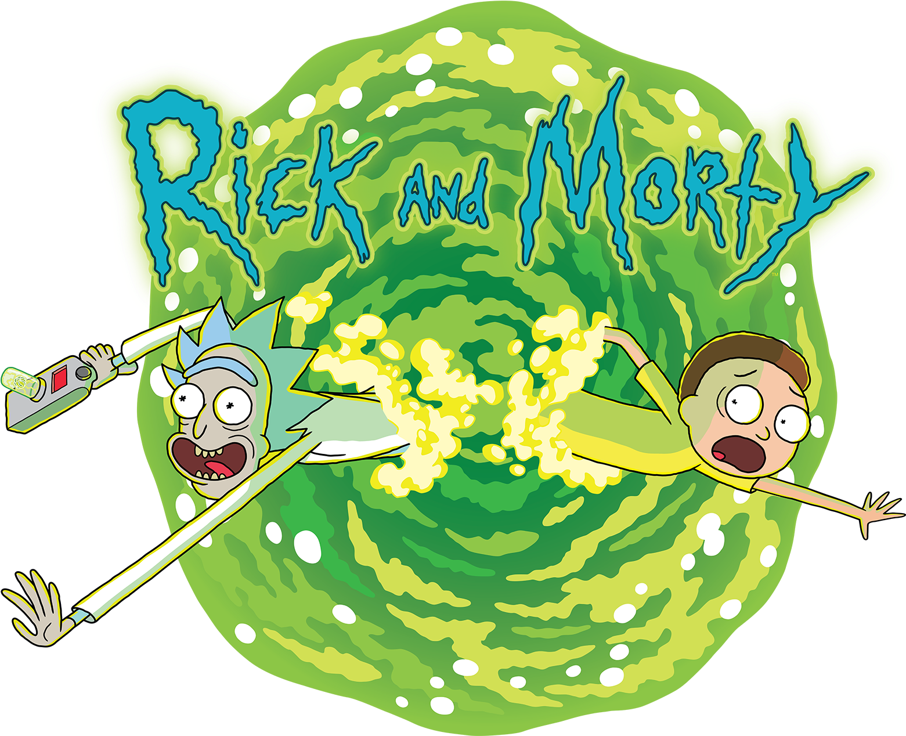

<a id="readme-top"></a>

<!-- PROJECT LOGO -->
<br />
<div align="center">
  <a href="https://github.com/github_username/repo_name">
    
  </a>

<h3 align="center">Ricky and Morty</h3>

  <p align="center">
    <br />
    <a href="https://github.com/akdasrabia/ricky-and-morty"><strong>Explore the docs »</strong></a>
    <br />
    <br />
    <a href="https://akdasrabia-rickandmorty.netlify.app/">View Demo</a>
  </p>
</div>


<!-- TABLE OF CONTENTS -->
<details>
  <summary><strong>Overview</strong></summary>
  
  
  
  <p align="right">(<a href="#readme-top">back to top</a>)</p>

</details>

### Built With

[](https://reactjs.org/)
<br/>
[](https://redux.js.org/)


### Installation
1. Clone the repo
   ```sh
   git clone https://github.com/github_username/repo_name.git
   ```
2. Install NPM packages
   ```sh
   npm install
   ```
3. Run the project
   ```sh
   npm start
   ```


## Contact

- GitHub [@akdasrabia](https://github.com/akdasrabia)
- [Contact Me](mailto:akdasrabian@gmail.com)


